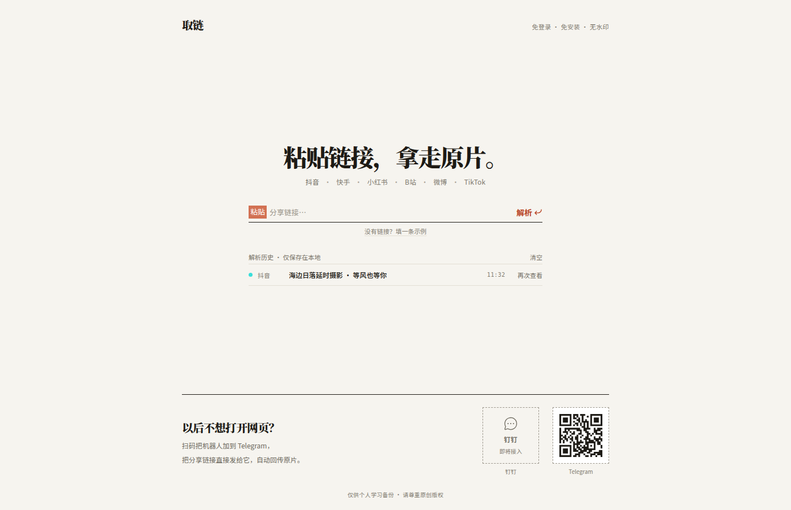
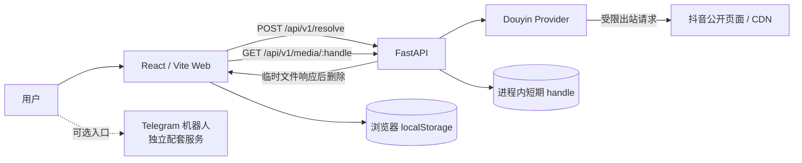

<div align="center">

# Linkix · 取链

粘贴公开分享链接，解析作品信息，并通过短时有效的取链地址下载原片。

[](https://github.com/ishuowang/linkix/actions/workflows/ci.yml)
[Telegram 机器人](https://t.me/vid_dld_bot)

</div>

> [!IMPORTANT]
> 当前可用平台只有 **抖音公开单视频**。快手、小红书、B 站、微博和 TikTok 目前只是界面中的路线图，不应被理解为已经支持。



## 能做什么

Linkix 把浏览器、解析 API 和媒体下载链路分开：

1. 在网页粘贴抖音分享文本、短链或公开视频链接。
2. API 展开短链并读取公开作品信息。
3. 前端只收到不透明、短时有效的媒体 handle，不会得到上游签名地址。
4. 下载时由 API 校验媒体域名、大小和响应内容，临时文件在响应结束后删除。
5. 最近八条解析历史只保存在当前浏览器的 `localStorage`。

内置的“填一条示例”使用演示数据，不会请求真实抖音服务，也不会产生可下载文件。

### 平台状态

| 平台 | 状态 | 当前范围 |
| --- | --- | --- |
| 抖音 | ✅ 可用 | 公开单视频；支持分享文本、短链和完整链接 |
| 快手 | 🧭 计划中 | Provider 尚未实现 |
| 小红书 | 🧭 计划中 | Provider 尚未实现 |
| B 站 | 🧭 计划中 | Provider 尚未实现 |
| 微博 | 🧭 计划中 | Provider 尚未实现 |
| TikTok | 🧭 计划中 | Provider 尚未实现 |

私密、已删除、地区受限、需要登录的内容以及图集不在当前支持范围内。

## 架构



Telegram 机器人目前独立运行，不包含在本仓库的 Web/API 启动命令中。入口：[打开 `@vid_dld_bot`](https://t.me/vid_dld_bot)。机器人二维码可通过 `npm run generate:assets` 重新生成。

## 本地运行

需要 Node.js 22、Python 3.11+（CI 使用 3.12）以及 Git。

### 1. 安装后端

```bash
git clone git@github.com:ishuowang/linkix.git
cd linkix

python3 -m venv .venv
source .venv/bin/activate
python -m pip install -e "api[dev]"
uvicorn linkix.app:app --host 127.0.0.1 --port 8010 --reload
```

健康检查：

```bash
curl http://127.0.0.1:8010/api/v1/health
```

### 2. 启动前端

另开一个终端：

```bash
cd linkix
npm ci
npm run dev
```

开发服务器会把 `/api` 代理到 `http://127.0.0.1:8010`。默认配置不需要 `.env`；需要修改限制或跨域来源时，可复制 `.env.example` 并在启动进程前导出其中变量。

### 3. 运行检查

```bash
npm test
npm run build
npm run test:sites

python -m ruff check api
python -m pytest api
```

## API

| 方法 | 路径 | 说明 |
| --- | --- | --- |
| `GET` | `/api/v1/health` | 服务健康状态 |
| `POST` | `/api/v1/resolve` | 接收 `{"text":"分享文本或链接"}`，返回作品信息和短期 handle |
| `GET` | `/api/v1/media/{handle}` | 校验 handle 后下载媒体文件 |
| `GET` | `/api/docs` | FastAPI 交互文档 |

错误使用 `application/problem+json`，响应中会携带 `code` 和 `request_id`，便于定位问题。

## 配置

常用配置位于 [.env.example](.env.example)：

| 变量 | 默认值 | 用途 |
| --- | --- | --- |
| `VITE_API_BASE_URL` | 空 | 前端构建时写入的 API 公网地址；同源部署保持为空 |
| `LINKIX_CORS_ORIGINS` | 本地 Vite 地址 | 允许访问 API 的完整 Origin，多个值用逗号分隔 |
| `LINKIX_MAX_MEDIA_BYTES` | `104857600` | 单个媒体文件最大字节数（默认 100 MiB） |
| `LINKIX_MEDIA_HANDLE_TTL_SECONDS` | `900` | 不透明下载 handle 的有效期 |
| `LINKIX_RESOLVE_LIMIT_PER_MINUTE` | `10` | 单个客户端每分钟解析次数 |
| `LINKIX_MAX_PARALLEL_DOWNLOADS` | `4` | 单进程并发下载上限 |
| `LINKIX_CONNECT_RETRIES` | `4` | 连接失败重试次数 |
| `LINKIX_BACKOFF_FACTOR` | `0.75` | 重试退避系数 |
| `LINKIX_DOUYIN_PROXY` | 空 | 抖音专用 HTTP(S) 代理；不要复用 Telegram 凭据 |
| `LINKIX_ENABLE_PARSER_FALLBACK` | `false` | 是否允许把作品 ID 交给第三方备用解析器 |
| `LINKIX_PARSER_API` | `https://douyin.wtf/...` | 备用解析器地址 |

建议保持备用解析器关闭。启用前应自行评估隐私、稳定性和第三方服务条款。

## 安全边界

- 输入只接受 HTTP/HTTPS，且域名必须属于抖音输入白名单；拒绝 URL 凭据、自定义端口和伪造后缀域名。
- 每次访问输入页和媒体前都会检查域名及 DNS 解析结果，拒绝私网、回环、链路本地等非公网地址，以降低 SSRF 风险。生产环境仍应配置出站防火墙。
- API 不向浏览器暴露抖音 CDN 的签名 URL，只返回随机 handle；默认 15 分钟后失效。
- 媒体下载有大小、并发、超时、重试和文件头校验；临时 MP4 在响应结束后删除，响应禁止私有缓存。
- 服务不把用户链接写入数据库；网页历史仅在本机浏览器中保存。日志、反向代理和监控仍需由部署者自行做脱敏。
- 限流器和 handle 存储目前都在进程内。请保持单 worker；多实例部署前需要改用 Redis 等共享存储。
- 不要把 Telegram token、代理凭据、Cookie、上游签名地址或用户提交的链接提交到 Git。

本项目只面向个人学习和对自己有权处理的内容。请遵守平台条款、当地法律和原创者授权，不要用于绕过访问控制或批量分发受版权保护的内容。

## 部署

### 前端：Vercel 或静态托管

前端是静态 Vite 应用：

- 构建命令：`npm ci && npm run build`
- 静态输出目录：`dist/client`
- 环境变量：`VITE_API_BASE_URL=https://你的-api-域名`

如果前端和 API 共用一个域名，可让 Nginx/Caddy 把 `/api/*` 反向代理到 `127.0.0.1:8010`，并保持 `VITE_API_BASE_URL` 为空。仓库同时保留 Sites 所需的 worker 和打包检查。

### 后端：Docker Compose

```bash
cp .env.example .env
# 至少把 LINKIX_CORS_ORIGINS 改为实际前端 Origin
docker compose up -d --build api
curl http://127.0.0.1:8010/api/v1/health
```

Compose 只把 API 暴露到本机 `127.0.0.1:8010`，建议在前面放置 HTTPS 反向代理或 Cloudflare Tunnel。示例配置见：

- [compose.yaml](compose.yaml)
- [Caddyfile.example](infra/Caddyfile.example)
- [linkix-api.service](infra/linkix-api.service)

当前 handle 在内存中，因此滚动发布、进程重启或切换实例都会使既有下载地址立即失效，这是有意的安全取舍。

## 仓库结构

```text
linkix/
├── src/                   # React 前端、结果页和本地历史
├── api/                   # FastAPI、抖音 Provider、安全校验和测试
├── public/assets/         # Telegram 二维码等静态资产
├── worker/                # 静态站点 SPA fallback
├── infra/                 # Caddy 与 systemd 示例
├── docs/reference/        # 产品设计参考图
├── docs/screenshots/      # 实现截图与设计 QA 对比图
└── .github/workflows/     # 前后端 CI
```

## 路线图

- 把 Provider 接口扩展到快手、小红书、B 站、微博和 TikTok。
- 为限流和媒体 handle 增加可选共享存储。
- 完善 Telegram 机器人与 Web API 的统一部署和可观测性。
- 增加真实上游的隔离集成测试，不在 CI 中保存 Cookie 或签名地址。

## License

[MIT](LICENSE)
